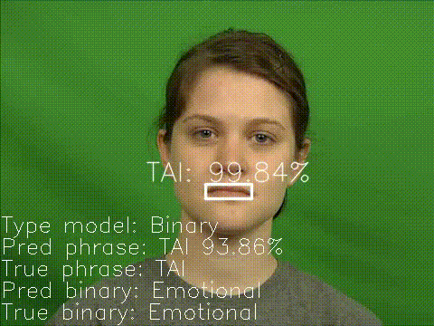

# EMOLIPS: Two-Level Approach for Emotional Speech Lip-Reading

<h4 align="center">
    
    
    
    
</h4>

We propose two-level approach for emotional speech recognition based on visual speech data processing (EMOLIPS). On the first level, we recognize an emotion class/valence as a base for further analysis. On the second level, we apply three different emotional lip-reading strategies: (1) 6-Emotions, (2) Valence, and (3) Binary (emotional/neutral data) one. 
The approach leverages recent advances in deep learning. So, we use 2DCNN-LSTM architecture for facial emotion recognition and 3DCNN-BiLSTM for phrases recognition by lip. 

We conducted our experiments on the emotional CREMA-D ([Cao et al., 2014](https://ieeexplore.ieee.org/document/6849440)) corpus containing 12 scripted phrases uttered with different emotions: anger, disgust, fear, happy, neutral, and sad.

Comparison of the results of the phrases  recognition accuracy of our approach (three strategies) with Baseline (model trained only on NE phrases) are presented in Table 1. The results have been achieved using our emotonal model (EMO-2DCNN-LSTM). Our experiments have shown that when using three models trained on phrases spoken with different valences (negative, neutral and positive), a gain in accuracy of 6% can be achieved compared to using a model trained only on neutral valence. Thus, the accuracy of recognition of phrases in the CREMA-D corpus, considering the two-level strategy, was 90.2%. At the same time, when using 6 emotional models based on phrases spoken with one of the six emotions, an accuracy of 86.8% is achieved (see Table 1, Acc=90.2% versus Acc=86.8% versus Acc=83.4%).

### Table 1.  Comparison of the results of the phrases recognition accuracy of our approach (three strategies) with Baseline (model trained only on NE phrases). Accuracy (Acc) shows phrase recognition performance without taking into account emotions/valency.

| Metric | Baseline| 6 Emotion | Valence | Binary |
| - | - | ---- | ---- | ---- |
| Acc | 83.4| 86.8 | 90.2 | 90.1 |

This result indicates that when combining 4 emotions (anger, disgust, fear, sad) into one negative valence, we increase the recognition accuracy because within this valence the facial features in the lip area differ significantly from the facial features of the other two valences, which simplifies the phrases recognition approach. This is also confirmed by the result of combining two opposite valences (negative and positive) into one class, we received a decrease in recognition accuracy by 1% (see Table 2, mAcc=92.7% versus mAcc=91.3%).

### Table 2.  Comparison of the results of the phrases recognition accuracy of our approach (three strategies) with Baseline (model trained only on NE phrases). The results have been achieved with an assumption that an emotional model makes predictions with a high accuracy. The mean accuracy (mAcc) shows the assessment of phrase recognition in the context of emotion/valence class.

| Metric | Baseline| 6 Emotion | Valence | Binary |
| - | - | ---- | ---- | ---- |
| mAcc | 83.6| 90.7 | 92.7 | 91.3 |
| Acc | 83.4| 90.7 | 91.6 | 90.8 |

In this GitHub repository we propose for common use (for scientific usage only) [the EMO-2DCNN-LSTM model](https://drive.google.com/drive/folders/15nO57yxGc36xwpnJk21r3517p7Km2xF3?usp=sharing) and [8 LIP-3DCNN-BiLSTM models](https://drive.google.com/drive/folders/1tZpDEnBU8Bmm-H9B0hI_5JrP5fmkrtKd?usp=sharing) obtained as a result of our experiments.

To train new lip-reading models, you should get acquainted the file ``train.py``. 

To predict emotions and phrases for all videos in your folder, you should run the command ``python run.py --path_video video/ --path_save report/``. 

To get new video file with visualization of emotions- and phrases predictions, you should run the command ``python visualization.py``. Below are examples of test videos:

### Citation

If you are using EMOLIPS in your research, please consider to cite researches. Here is the examples of BibTeX entry:

<pre>@inproceedings{IVANKO2023ICASSP,
  title         = {EMOLIPS: Two-Level Approach for Emotional Speech Lip-Reading},
  author        = {Denis Ivanko and Elena Ryumina and Alexandr Axyonov and Alexey Kashevnik and DmitryRyumin and Alexey Karpov},
  inproceedings = {ICASSP},
  year          = {2023},
}

<pre>@article{RYUMINA2022SPECOM,
  title         = {Emotional speech recognition based on lip-reading},
  author        = {Elena Ryumina and Denis Ivanko},
  journal       = {24th International Conference on Speech and Computer (SPECOM), Lecture Notes in Computer Science},
  volume        = {13721},
  year          = {2022},
}

<pre>@article{RYUMINA2022,
  title         = {In Search of a Robust Facial Expressions Recognition Model: A Large-Scale Visual Cross-Corpus Study},
  author        = {Elena Ryumina and Denis Dresvyanskiy and Alexey Karpov},
  journal       = {Neurocomputing},
  year          = {2022},
  volume        = {514},
  pages         = {435-450},
  doi           = {10.1016/j.neucom.2022.10.013},
  url           = {https://www.sciencedirect.com/science/article/pii/S0925231222012656},
}

### Links to papers

- [H. Cao, D. G. Cooper, M. K. Keutmann, R. C. Gur, A. Nenkova and R. Verma, "CREMA-D: Crowd-Sourced Emotional Multimodal Actors Dataset," IEEE Transactions on Affective Computing, vol. 5, no. 4, pp. 377-390,2014, doi: 10.1109/TAFFC.2014.2336244.](https://ieeexplore.ieee.org/document/6849440)
